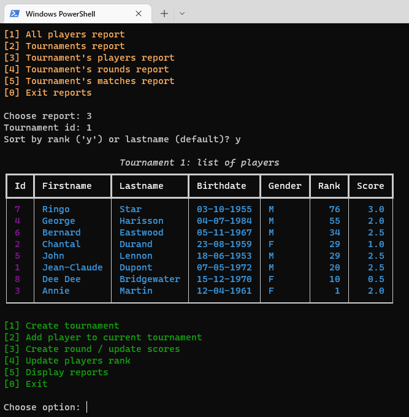
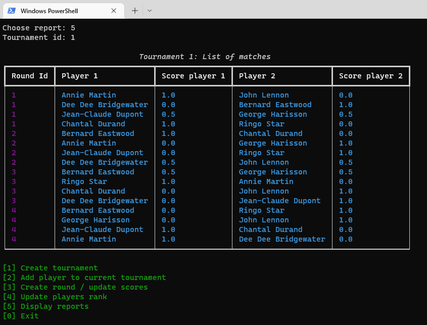
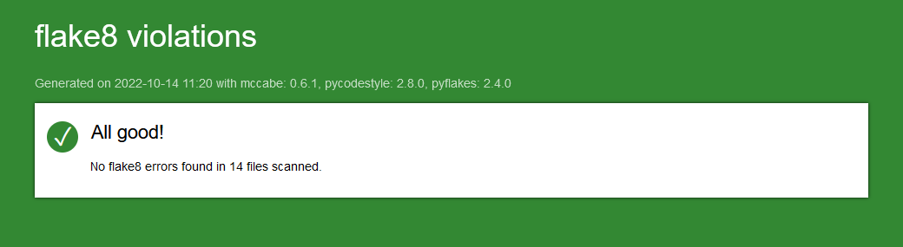

# Chess championship

Chess championship is a Python desktop application to manage chess tourmanents.

## Installation

### Python installation:
If you don't have python installed, download and install python from here : https://www.python.org/downloads/

```bash
git clone https://github.com/phi-lemon/chess.git
```


### Software installation
Create a virtual environnement, activate it and install the packages.  
Open a terminal, go in the folder where you downloaded the project files e.g. ```cd chess``` 
and type the folowing commands :
```bash
python -m venv venv
venv\Scripts\activate  # on windows
source venv/bin/activate  # on linux
pip install -r requirements.txt
```

## Usage

Activate the virtual environment:

```bash
venv\Scripts\activate  # on windows
source venv/bin/activate  # on linux
```

### Launch the application:
```bash
python main.py
```
Follow the instructions


## Screenshots:

<br/><br/>


## Flake8 reports
To generate a flake8 report, launch this command from the project folder:
```bash
flake8 --format=html --htmldir=flake-report
```
If everything is OK, you should see this message:<br/><br/>


## License
[MIT](https://github.com/phi-lemon/chess/blob/main/LICENSE.md)
